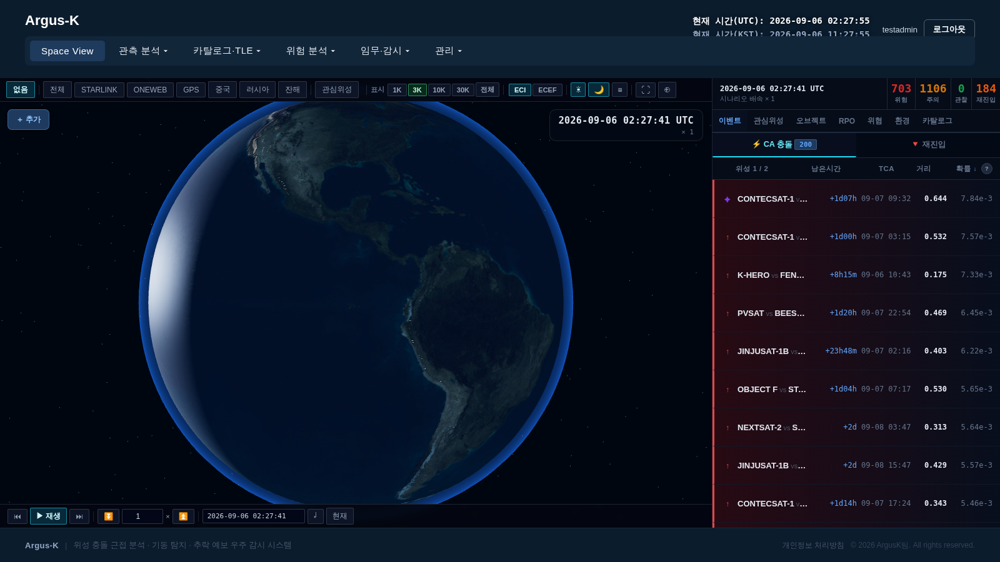
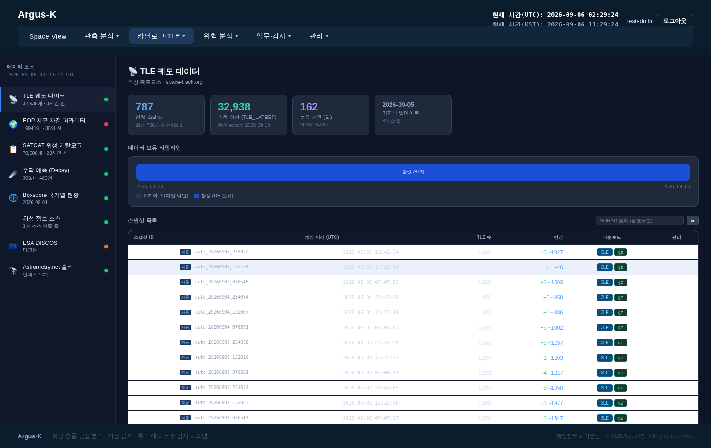
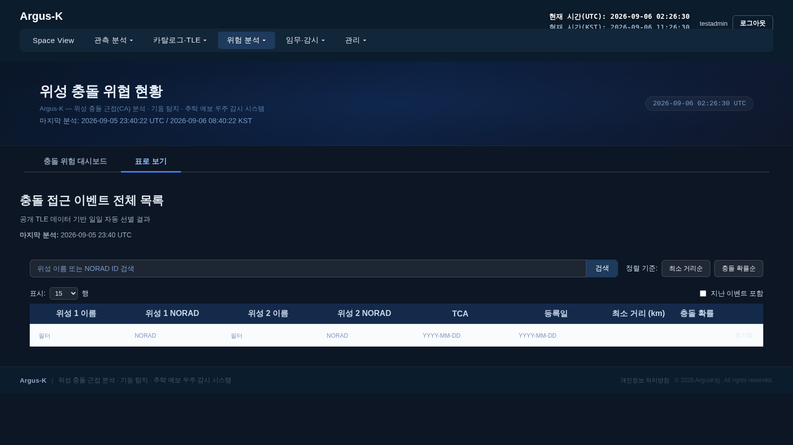
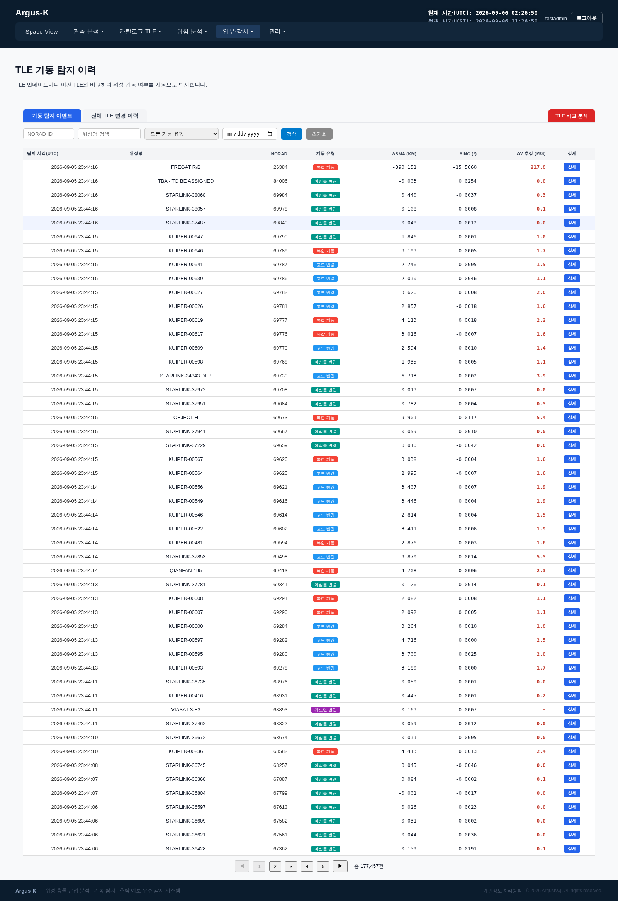
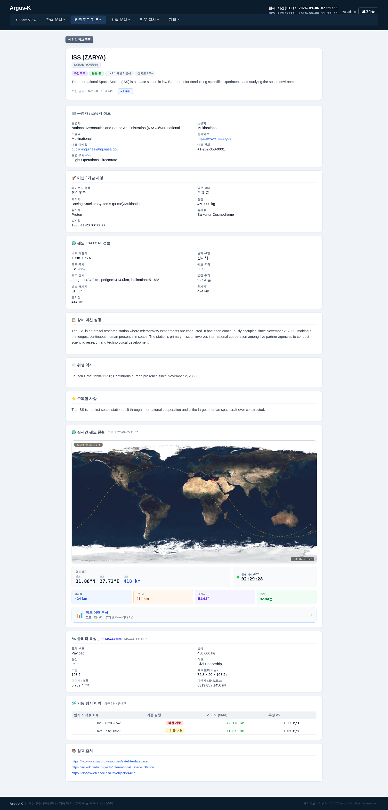
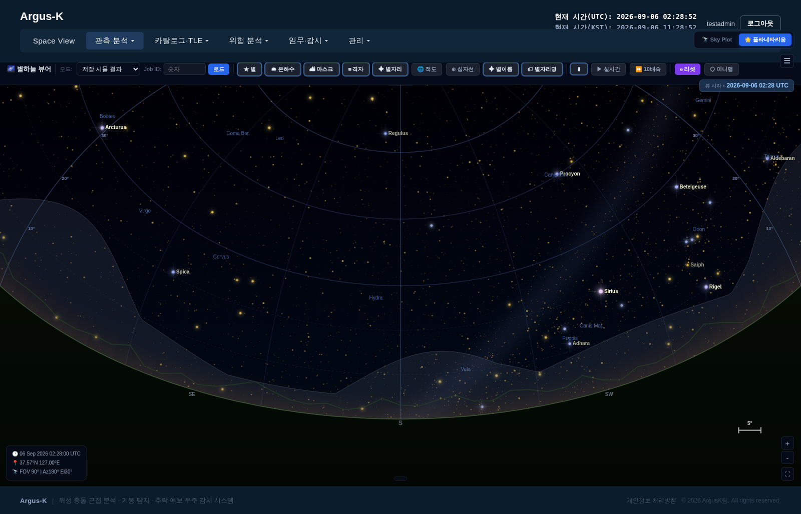

# ArgusK

**대규모 위성 궤도 데이터를 실시간으로 수집·분석하는 우주 상황인식(SSA) 웹 플랫폼**
전 세계 위성 33,000여 개를 실시간 추적하고, 충돌 근접·기동·재진입을 분석합니다.
설계부터 개발, 인프라 구성, 클라우드 배포, 운영까지 1인 개발·운영 중입니다.

🔗 **Live:** [lab.sejong-stm.cloud](https://lab.sejong-stm.cloud) · 🛰️ 현재 라이브 운영 중

---


<sub>3D 지구본에서 위성을 실시간 추적하고, 충돌 근접(CA) 이벤트를 확률 순으로 정렬해 표시. ECI/ECEF 좌표계 전환·시간 배속 지원.</sub>

---

## 한눈에 보는 규모

| | |
|---|---|
| 🛰️ 실시간 추적 위성 | **33,000+** 개 |
| 📦 TLE 궤도 데이터 아카이브 | **710만+** 행 |
| ⚠️ 충돌 근접(CA) 이벤트 | **18만+** 건 추적 |
| 🔀 기동 탐지 이벤트 | **17만+** 건 누적 |
| 🧩 API 엔드포인트 | **약 360개** |
| 🐳 운영 컨테이너 | **11개** (Docker Compose) |
| 💻 코드베이스 | Python ~42,000줄 · JS ~16,000줄 · HTML ~47,000줄 |

> 외부 데이터 소스에서 궤도 데이터를 정기 수집하고, 정제·분석·시각화·알림까지 이어지는
> 전체 데이터 파이프라인을 자동화하여 상시 운영하고 있습니다.

---

## 이 프로젝트로 증명하는 것

ArgusK는 위성이라는 특수 도메인을 다루지만, 그 안에서 구현한 역량은 도메인과 무관하게 적용됩니다.

- **대용량 데이터 파이프라인** — 수백만 행 규모의 시계열 데이터를 정기 수집·정제·아카이빙하고, 조회 성능을 위해 다계층 저장 구조와 쿼리 최적화를 설계했습니다.
- **실시간 처리·연산** — SGP4 궤도 전파를 `numpy` 배치 연산으로 벡터화하고 Redis로 캐싱하여, 대량 객체에 대한 실시간 계산을 처리합니다.
- **풀스택 + 인프라** — 프론트엔드·백엔드·DB·캐시·메시징·크롤러·스케줄러·리버스 프록시를 직접 구성하고 컨테이너로 오케스트레이션했습니다.
- **LLM 파이프라인 활용** — 여러 LLM(Gemini·로컬 qwen)과 외부 데이터를 결합해 7만여 위성 정보를 자동 분류·보강하는 파이프라인을 구축했습니다.
- **자율 운영** — 정기 수집, 품질 검증 cron, 이상 이벤트 Telegram 알림까지 사람이 개입하지 않아도 돌아가도록 자동화했습니다.

---

## 핵심 기능

### 1. TLE 궤도 데이터 수집·아카이브
Space-Track, Celestrak, ETH Zurich 등에서 궤도요소(TLE)를 자동 수집합니다.
월별 압축 아카이브와 데이터베이스에 이중 보관하며, **710만 행** 이상의 궤도 이력을 관리합니다.


<sub>Space-Track에서 정기 수집한 스냅샷 이력. 활성 데이터는 DB에, 과거 데이터는 압축 파일로 이중 보관.</sub>

### 2. 충돌 근접(Conjunction Assessment) 분석
위성 간 충돌 근접 이벤트를 추적하고 SGP4 기반으로 정밀 분석합니다.
분석 작업을 큐로 관리하여 대량 이벤트(**18만+ 건**)를 순차 처리합니다.


<sub>충돌 근접 이벤트를 위험도(RED/YELLOW/GREEN)로 자동 분류. TCA·최소거리·충돌확률 기준 적용.</sub>

### 3. 기동 탐지 (Maneuver Detection)
연속된 TLE의 변화량(delta)을 분석해 위성의 궤도 기동을 자동 탐지합니다.
**17만+ 건**의 기동 이벤트를 누적 관리합니다.


<sub>궤도장반경(ΔSMA)·경사각(ΔINC) 변화로 기동을 탐지하고 ΔV를 추정. 기동 유형별로 자동 분류.</sub>

### 4. 지상 관측소 연동
관측 앱(obsDroid)과 연동해 관측 데이터(트랙렛)를 업로드받고, astrometry로 이미지를 분석해
어떤 위성인지 매칭합니다. 관측 시각 기준으로 가장 가까운 궤도요소를 찾아 대조합니다.

### 5. 위성 정보 자동 보강 (Enrichment)
ESA DISCOS·UCS 등 외부 카탈로그와 웹 정보, LLM을 결합해
**7만여 위성**의 상세 정보를 자동 수집·분류합니다.

---

## 화면 둘러보기

**위성 상세 — 실시간 지상궤적 + 통합 정보**

<sub>SGP4로 계산한 실시간 지상궤적을 지도에 표시하고, SATCAT·ESA DISCOS 물리 제원·기동 이력을 한 페이지에 통합.</sub>

**Sky Viewer — 관측용 플라네타리움**

<sub>관측소 위치·시각 기준으로 하늘을 렌더링. 별·별자리·적도·지평선을 표시하고 위성 궤적을 겹쳐 관측을 지원.</sub>

> 이 외에도 3D Space View, IOD 궤도결정(Gauss + EKF), 관측 트랙렛 매칭,
> 재진입 예측, 궤도 혼잡도 분석, 위성군 프로파일 등의 화면이 있습니다. → [lab.sejong-stm.cloud](https://lab.sejong-stm.cloud)

---

## 시스템 아키텍처

```
[외부 데이터 소스]
  Space-Track / Celestrak / ETH Zurich / ESA DISCOS / UCS
        │
        ▼
  ┌─────────────┐   정기 수집        ┌──────────────────────────────┐
  │ tle_fetcher │ ─────────────────► │  backend (Flask API)         │
  │  크롤러      │   POST /tle/delta  │  gunicorn · 약 360개 엔드포인트│
  └─────────────┘                    │  SGP4 전파 · 좌표변환          │
                                     └──────────────┬───────────────┘
[사용자] ──HTTPS──► [Cloudflare Tunnel]             │
                        │              ┌────────────┼────────────┐
                        ▼              ▼            ▼            ▼
                     [nginx]      [MariaDB]     [Redis]     [MQTT]
                        │          72개 테이블   SGP4 캐시   관측 이벤트
                        ▼          710만 행      (5분 TTL)
                   [frontend]
                   Flask+Jinja2
                   75 HTML · 140 JS

  [scheduler] ── 정기 동기화 · 품질검증 cron · Telegram 알림
  [enrichment] ── Gemini / qwen LLM 노드로 위성 정보 자동 분류
```

포트를 외부에 직접 노출하지 않고 **Cloudflare Tunnel**로만 HTTPS를 제공하여 공격 표면을 최소화했습니다.

---

## 기술 스택

**Backend** · Python 3, Flask, Flask-RESTful, gunicorn
**Frontend** · Jinja2, Vanilla JS, CSS
**Database / Cache / Messaging** · MariaDB 10.6, Redis 7, MQTT (Mosquitto)
**궤도 역학 / 연산** · sgp4, numpy, scipy (SGP4 전파, ECI↔ECEF 좌표변환, 배치 전파)
**이미지 분석** · Pillow, astrometry.net
**LLM** · Google Gemini API, ollama (qwen2.5, 로컬)
**Auth** · JWT (쿠키), Bearer Token (관측소·자동화), 권한 프로파일
**Infra** · Docker Compose (11 containers), Oracle Cloud (ARM Ampere), Cloudflare Tunnel
**기타** · Telegram Bot(알림), paho-mqtt, bcrypt

---

## 기술적으로 공들인 부분

**궤도요소 4계층 조회 구조**
관측 시각 기준으로 "그 순간 가장 정확한 궤도요소"를 재현하기 위해,
`tle_changes → TLE_DATA → 압축 아카이브 → 최신 TLE` 순으로 조회하는 우선순위 구조를 설계했습니다.

**대용량 쿼리 최적화**
특정 날짜의 위성 카탈로그를 조회하는 쿼리를 CTE 방식(약 90초)에서
Python 2단계 처리 + 인덱스 설계로 **약 7초**까지 단축했습니다.

**SGP4 배치 전파**
N개 위성 × M개 시각을 행렬 연산으로 한 번에 전파(`numpy`)하여,
관측 트랙렛과 다수 위성을 실시간으로 대조할 수 있게 했습니다.

**AI 분산 파이프라인**
Gemini·qwen·Claude 노드에 역할을 분담시켜 7만여 위성 정보를 자동 분류하는
파이프라인을 구성했습니다.

---

## 배포·운영

- **인프라** · Oracle Cloud, VM.Standard.A1.Flex (ARM Ampere)
- **구성** · Docker Compose 11개 컨테이너 (frontend · backend · scheduler · db · redis · mqtt · nginx · cloudflared · tle_fetcher · enrichment · telegram_worker)
- **외부 접근** · Cloudflare Tunnel (서버 포트 직접 노출 없이 HTTPS 제공)
- **상태** · 라이브 운영 중 — [lab.sejong-stm.cloud](https://lab.sejong-stm.cloud)

---

## 개발자

1인 설계·개발·배포·운영.
데이터 수집 파이프라인, 백엔드 API, 프론트엔드, 데이터베이스 스키마, 인프라 구성,
클라우드 배포까지 전 영역을 담당했습니다.
